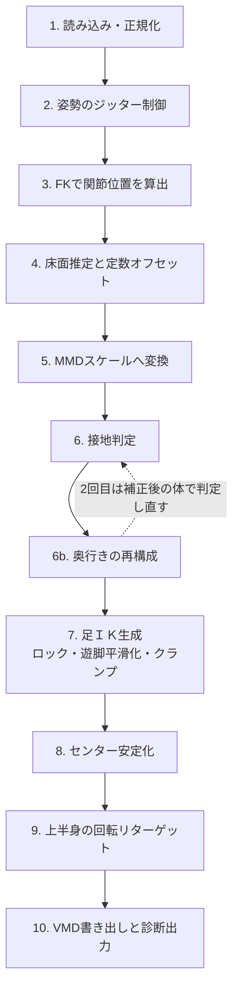

# NLF→VMD変換

## 処理パイプライン

処理は次の順序で行い、順番を入れ替えないこと。特に「床オフセット→接地判定→ロック→クランプ」の順序が崩れると、接地判定の基準がずれたり、ロック値に歪んだ値が混ざる。



## 各ステージの詳細仕様

数値はすべて初期値であり、設定ファイルで変更可能にすること。長さのしきい値はメートルで定義し、ステージ5以降はスケール係数を掛けて使う。

### 1. 読み込み・正規化

- 内部共通形式：関節回転（T×24のクォータニオン）、β（10）、ルート移動量（T×3、メートル）、fps。座標系はY上向き・右手系に統一する。
- 入力がカメラ座標（Y下向き・Z奥向き）なら、X軸周り180度回転で変換する。ルートの向き（global orient）にも同じ回転を掛ける。
- βがフレーム毎にある場合は全フレームの中央値で1つに固定する（骨長の伸縮による震えを防ぐため）。
- 30fpsにリサンプルする（回転は球面線形補間、移動量は線形補間）。
- 複数人物が含まれる場合は、指定した1人だけを扱う。

### 2. 姿勢のジッター制御

- 各関節のクォータニオンは、前フレームとの内積が負なら符号を反転して連続性を揃える。軸角やオイラー角のまま平滑化しない。
- 外れ値除去：角速度がしきい値（初期値 720度/秒）を超える単独フレームは前後から補間して置き換える。
- 平滑化：クォータニオン成分にOne Euroフィルタを掛けて正規化する。強さは関節グループ（体幹・頭・腕・手首・脚）別に設定する。
- ルート移動量はここでは窓幅5のメディアンフィルタでスパイクを除くだけにし、本格的な安定化はステージ8で行う（奥行きはステージ6b）。

### 3. FKで関節位置を算出

- βから初期姿勢の関節位置を求め（テンプレート頂点＋体型ブレンドシェイプに関節回帰行列を適用）、親子関係に従ってFKする。
- 使う関節：骨盤(0)、股関節(1,2)、膝(4,5)、足首(7,8)、足先(10,11)、背骨(3,6,9)、首(12)、頭(15)、鎖骨(13,14)、肩(16,17)、肘(18,19)、手首(20,21)。
- かかととつま先の接地点を得るため、初期姿勢メッシュから足首・足先に主にスキンされた頂点のうち、最下点かつ最後方（かかと）・最前方（つま先）の頂点を自動選択し、その数頂点だけLBSで毎フレーム位置を計算する。

### 4. 床面推定と定数オフセット

- かかと・つま先のうち、水平速度が低いフレーム（初期値 0.2 m/s未満）の点を集め、RANSACで平面を当てはめる。
- 平面の法線が+Yになるよう全体を回転し、床の高さが0になるよう定数オフセットを決める。オフセットは低速点の高さの中央値から求め、平均値は使わない。
- オフセットはシーケンス全体で1つの定数とし、ルート移動量と全関節に同じ値を加える。フレーム毎に変化する補正は絶対に入れない。
- オプション：長尺で床が変わる場合のため、区間ごとの定数にするモードを用意する。区間間は1秒以上かけてコサイン補間する。

### 5. MMDスケールへの変換

- スケール係数 = 対象モデルの脚長（足→ひざ→足首の距離の合計、PMXから取得）÷ SMPLの脚長（股関節→膝→足首）。左右の平均を使う。
- 全位置にスケール係数を掛ける。加えて、奥行き方向の移動量だけを縮小する倍率（初期値 1.0）を設定できるようにする。

### 6. 接地判定

- 左右の足それぞれについて、かかとまたはつま先のどちらかが「高さ < しきい値」かつ「水平速度 < しきい値」なら接地とする。
- ヒステリシス：接地開始は高さ 3cm・速度 0.25 m/s、接地終了は高さ 5cm・速度 0.4 m/s（初期値）とし、終了条件を緩くする。
- 後処理：2フレーム以下の非接地の隙間は埋め、その後4フレーム未満の接地区間は捨てる。
- 水平速度は、奥行き（カメラの光軸方向）のぶれを除いて求める（ステージ6b参照）。高さは元の値を使う。
- 出力：足ごとの接地フラグ列と、接地区間（開始・終了フレーム）のリスト。

### 6b. 奥行きの再構成

単眼動画からの推定では、左右・上下の位置は画像上の位置から決まるので安定しているが、奥行きは毎フレーム数cmぶれ、ゆっくりずれていく。骨盤の奥行きがぶれると体全体が前後に揺れ、床に着いている足も一緒に動く。すると水平速度がしきい値を超えて接地判定が途切れ、ロックされないフレームや区間ごとのロック位置の食い違いが、Z方向の足滑りになる。そこで次の2つを行う。

- **接地判定の速度**：奥行き方向のぶれを2通りの方法で除き、速度の小さいほうを使う。
  - 骨盤の奥行きをローパス（初期値 0.5Hz）で平滑化し、体全体の前後の揺れを除く。着地・離地の瞬間の速度の変化は鋭いまま残るが、本当の重心の前後移動（ダンスの揺れ）も消えるので、これだけだと床に着いた足が動いて見える。
  - 接地点の奥行きを直接ローパス（初期値 2Hz）で平滑化する。床に着いた足の奥行きは一定なので、体が前後に揺れていても速度は0になる。ただし遊脚の速度の変化がなまるので、これだけだと接地の始まりと終わりを取りこぼす。
- **骨盤の奥行きの再構成**：骨盤の奥行き r(t) を、次の3つの重み付き最小二乗で求め直す（未知数は r と、接地区間ごとの足首の奥行き L）。
  - 接地：接地区間内の各フレームで (r + 足首の相対奥行き − L) / 0.5cm
  - 事前：(r − 推定された奥行き) / 50cm（全体の移動の目安。弱い重み）
  - 加速度：r の2階差分 / (3 m/s² ÷ fps²)
- 足首の相対奥行き（足首 − 骨盤）は、ステージ2で平滑化する前の姿勢から求め、窓幅5のメディアンで単独フレームの外れ値だけを除く。平滑化した姿勢では遊脚の速い動きが接地の前後に混ざり、床に着いた足首が1歩あたり数cm前へずれる。それを止めようとして骨盤が引き戻され、歩いた距離が短くなるため。
- 補正は体全体（全関節・接地点）を奥行きの軸に沿って平行移動するだけで、姿勢は変えない。奥行きの軸はカメラの光軸（床の傾き補正を掛けた後の座標で表したもの）。
- 「接地判定→再構成」を2回行う。2回目は補正後の体で接地を判定し直し、両足が同時に前後へ動いて見えたために1回目の判定から漏れたフレームも拾う。
- 以降のステージ（足ＩＫ・センター）は補正後の位置を使う。

### 7. 足ＩＫの生成

足ＩＫのターゲットは足首関節の位置とする。VMDに書く値は初期位置からの差分なので、差分のY=0が「足裏が床に着いた状態」になる。

- **接地区間のロック**：区間内の位置はXYZすべて、区間内の中央値の一定値にする。足ＩＫの回転も区間内の平均クォータニオンで固定し、接地中に足先が回らないようにする。
- **遊脚の平滑化**：非接地区間は足首位置にOne Euroフィルタを掛ける（速い動きは残し、遅い震えを消す）。
- **境界のブレンド**：接地区間の端では、「ロック値−遊脚値」の差分を求め、遊脚側の数フレーム（初期値 5）でスムーズステップ曲線に沿って減衰させて加算する。ブレンドを接地区間の内側には入れない。
- **0クランプ**：最後に足ＩＫの差分Yが0未満のフレームをすべて0にする。これは残差の保険であり、ロックより先に実行しない。
- 足ＩＫを上に持ち上げる補正は膝が曲がる方向なので安全である。脚が届かない問題は足ＩＫではなくステージ8でセンターを下げて解決する。

### 8. センターの安定化

水平移動はセンター、上下移動はグルーブに分けて出力する（グルーブが無いモデルではセンターのYへ）。センターをフレーム毎に持ち上げる処理は実装しない。

- **モードA：軸別平滑化（初期値）**：骨盤位置にX・Y・Z軸ごとに強さの異なるOne Euroフィルタを掛ける。奥行き（Z）を最も強くする。
- **モードB：接地足からの逆算**：接地中は「ロックした足ＩＫ位置＋姿勢から求めた足首→骨盤の相対ベクトル」で骨盤位置を計算する。両足接地時は両足からの値を平均する。両足が離れた区間は前後の値から、水平は3次補間、上下は放物線で補間する。最後に軽く平滑化する。
- **届く高さへのクランプ（両モード共通）**：各フレームで、左右の股関節から足ＩＫターゲットまでの距離が脚長の98%以下になる最大の骨盤高さを求める。補正量 = min(0, 許容高さ − 現在の高さ) とし、下げる方向のみとする。
- 補正量カーブは、先に移動最小値フィルタ（初期値 窓幅9）、次にガウシアン平滑化（初期値 σ=2）の順で処理してから適用する。普通の平滑化だけだとピークが削れて許容高さを超えるため。
- 適用後に再判定し、なお超過するフレーム数を診断出力に記録する。

## VMD変換仕様

脚は足ＩＫの位置キー、体の移動はセンター／グルーブ、上半身と腕は回転キーで出力する。脚のFKボーンにはキーを打たない。

### 座標変換

- 内部形式（右手系・Y上向き）からMMD（左手系・Y上向き）へは、位置 (x, y, z) → (x, y, −z)、クォータニオン (x, y, z, w) → (−x, −y, z, w) とする。
- MMDのモデルは−Z方向を正面とする。変換後に体の向きが逆になる場合に備え、Y軸周り180度回転を掛けるオプションを用意し、前進するテストクリップで向きと進行方向を必ず確認する。

### ボーン対応

| MMDボーン | キーの種類 | ソース |
| --- | --- | --- |
| センター | 位置（X, Z） | ステージ8の骨盤水平位置 |
| グルーブ | 位置（Y） | ステージ8の骨盤高さ |
| 下半身 | 回転 | 骨盤(0) |
| 上半身 | 回転 | 背骨(3, 6) |
| 上半身2 | 回転 | 背骨(9)。無いモデルは上半身に合成 |
| 首 | 回転 | 首(12) |
| 頭 | 回転 | 頭(15) |
| 左肩・右肩 | 回転 | 鎖骨(13, 14) |
| 左腕・右腕 | 回転 | 肩(16, 17) |
| 左ひじ・右ひじ | 回転 | 肘(18, 19) |
| 左手首・右手首 | 回転 | 手首(20, 21) |
| 左足ＩＫ・右足ＩＫ | 位置＋回転 | ステージ7の出力 |

足・ひざ・足首・つま先ＩＫ・捩りボーンには初版ではキーを打たない。

### キー値の計算

- **位置キー**：ボーンの初期位置からの差分を親ボーンの座標系で書く。センターと足ＩＫは親にキーを打たないので、「ターゲット位置 − PMXの初期位置」でよい。回転キーが無いボーンの回転は恒等回転 (0, 0, 0, 1) とする。
- **回転キー（初期姿勢補正方式）**：SMPLはTポーズ、MMDモデルは多くがAポーズなので、回転をそのままコピーしない。ボーンごとに補正回転Cを求め、次の式で計算する。

```latex
R^{mmd}_{global} = R^{smpl}_{global} \cdot C, \quad R^{mmd}_{local} = (R^{mmd}_{global,parent})^{-1} \cdot R^{mmd}_{global}
```

- 手足のボーンのCは、PMXの初期姿勢のボーン方向（子ボーンへの向き）をSMPLの初期姿勢の方向に合わせる最小回転とする。
- 下半身・上半身など体幹のCは、「上向き方向」と「左右方向（左右の股関節または肩を結ぶ向き）」の2ベクトルで座標系を合わせて求める（ヒネリのズレを防ぐため）。
- 足ＩＫの回転も同じ方式で、足首(7, 8)のグローバル回転と補正回転から求める。

### VMDファイル形式

- ヘッダ：「Vocaloid Motion Data 0002」を30バイトにヌル埋め。続けてモデル名を20バイト（cp932、ヌル埋め）。
- ボーンキー数（uint32、リトルエンディアン）に続き、1キー111バイト：ボーン名15バイト（cp932）、フレーム番号 uint32、位置 float32×3、回転 float32×4（x, y, z, w）、補間パラメータ64バイト。
- その後にモーフ・カメラ・照明・セルフ影のキー数を各 0 で書く。
- 補間パラメータは線形（制御点 20, 20, 107, 107）とする。64バイトのレイアウトは既存の実装や仕様資料で確認してから実装し、推測で埋めない。
- ボーン名の「ＩＫ」は全角。cp932で15バイトを超える名前は警告を出す。
- キーは全フレームに打つ（間引きは後述のオプション）。間引きを有効にしても、接地区間の開始・終了フレームの足ＩＫキーは必ず残す。

## 検証・診断出力とテスト

「ガクブルが減ったか」を目視だけで判断しないよう、処理前後の数値とグラフを毎回出力する。

**評価指標（処理前・処理後を並べてJSONで保存）**

| 指標 | 定義 | 目標 |
| --- | --- | --- |
| 足滑り | 接地区間内の足ＩＫの水平移動量の平均（cm/フレーム） | 0 |
| 埋まり | 足ＩＫの差分Yが0未満のフレーム数 | 0 |
| センターの震え | センター・グルーブ位置の加速度の絶対値の平均（軸別） | 処理前より大幅に減少 |
| 姿勢の震え | 各関節の角加速度の平均（グループ別） | 処理前より減少 |
| 脚の伸び切り | 股関節から足ＩＫまでの距離が脚長の98%を超えるフレーム数 | 0 |
| 接地切り替え回数 | 足ごとの接地区間の数 | 目視との整合を確認 |
| 床付近の足の動き | 足が床付近（かかとかつま先が接地終了の高さ未満）にあるときの足ＩＫの移動量の平均（X, Z別、cm/フレーム） | Z（奥行き）がXと同程度まで減少 |

**グラフ（PNG）**

- 左右の足の高さと水平速度、接地フラグの帯表示（判定の妥当性確認用）
- センターのX・Y・Zの処理前後の比較
- 骨盤の奥行きの処理前後の比較（ステージ6bの補正量の確認用）と、奥行き・横方向のぶれの大きさ
- 届く高さへのクランプの補正量カーブ
- 足ＩＫの水平軌跡の上面図（接地点が点になっているか確認用）

**自動テスト（pytest）**

- フィルタ：ノイズを加えた正弦波で震えが減り、遅延が許容内に収まること。クォータニオンの符号反転を含む入力で跳ねないこと。
- 接地判定：合成した歩行データ（接地区間が既知）で、推定区間が正解と±1フレーム以内で一致すること。
- 足ＩＫ：接地区間内の位置が完全に一定であること。境界でフレーム間の移動量が設定値を超えないこと。
- 奥行き：単眼推定のような奥行きのぶれ（毎フレーム3cm＋ゆっくりしたずれ8cm）を加えた合成データ（前進する歩行、骨盤を前後に揺らしながらの足踏み）で、正解の接地区間での足ＩＫのZ方向の移動量がXと同程度（0.03cm/フレーム未満）になること。ぶれが無いときは接地区間が変わらず、歩いた距離もほぼ変わらないこと。補正が体全体の平行移動であること。
- センター：届く高さへのクランプ後、補正が上向きになっているフレームが存在しないこと。
- VMD：書き出したファイルを自前のリーダーで読み戻し、ボーン名・フレーム数・値が一致すること。
- 座標変換：+Z方向に歩く合成データで、出力の進行方向と体の向きが一致すること。

**手動確認（利用者が行う）**

- MikuMikuDanceまたはMikuMikuMovingで読み込み、足の滑り・埋まり・膝の暴れ・全身の震えを目視確認する。
- 問題があれば、該当フレーム番号と症状を伝えて設定値の調整や修正を依頼する。
