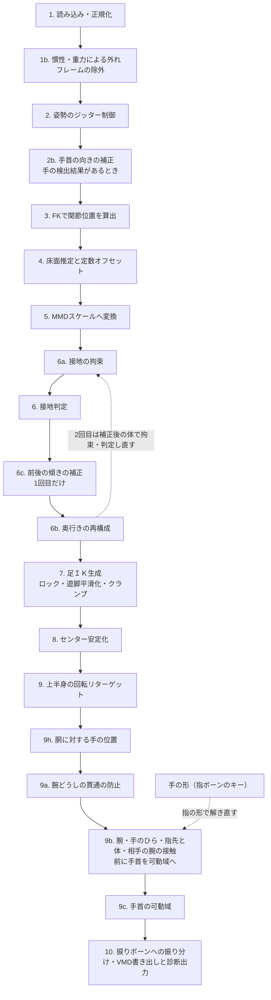

# NLF→VMD変換

## 処理パイプライン

処理は次の順序で行い、順番を入れ替えないこと。特に「床オフセット→接地判定→ロック→クランプ」の順序が崩れると、接地判定の基準がずれたり、ロック値に歪んだ値が混ざる。


```mermaid
flowchart TD
  A[1. 読み込み・正規化] --> A2[1b. 慣性・重力による外れフレームの除外]
  A2 --> B[2. 姿勢のジッター制御]
  B --> B2[2b. 手首の向きの補正<br/>手の検出結果があるとき]
  B2 --> C[3. FKで関節位置を算出]
  C --> D[4. 床面推定と定数オフセット]
  D --> E[5. MMDスケールへ変換]
  E --> F0[6a. 接地の拘束]
  F0 --> F[6. 接地判定]
  F --> F3[6c. 前後の傾きの補正<br/>1回目だけ]
  F3 --> F2[6b. 奥行きの再構成]
  F2 -. 2回目は補正後の体で拘束・判定し直す .-> F0
  F2 --> G[7. 足ＩＫ生成<br/>ロック・遊脚平滑化・クランプ]
  G --> H[8. センター安定化]
  H --> I[9. 上半身の回転リターゲット]
  I --> I1[9h. 胴に対する手の位置]
  I1 --> I2[9a. 腕どうしの貫通の防止]
  I2 --> I3[9b. 腕・手のひら・指先と体・相手の腕の接触<br/>前に手首を可動域へ]
  I3 --> I4[9c. 手首の可動域]
  I4 --> J[10. 捩りボーンへの振り分け・VMD書き出しと診断出力]
  K[手の形（指ボーンのキー）] -. 指の形で解き直す .-> I3
```

## 各ステージの詳細仕様

数値はすべて初期値であり、設定ファイルで変更可能にすること。長さのしきい値はメートルで定義し、ステージ5以降はスケール係数を掛けて使う。

### 1. 読み込み・正規化

- 内部共通形式：関節回転（T×24のクォータニオン）、β（10）、ルート移動量（T×3、メートル）、fps。座標系はY上向き・右手系に統一する。
- 入力がカメラ座標（Y下向き・Z奥向き）なら、X軸周り180度回転で変換する。ルートの向き（global orient）にも同じ回転を掛ける。
- βがフレーム毎にある場合は全フレームの中央値で1つに固定する（骨長の伸縮による震えを防ぐため）。
- 30fpsにリサンプルする（回転は球面線形補間、移動量は線形補間）。
- 複数人物が含まれる場合は、指定した1人だけを扱う。
- **検出できなかったフレーム**（入力の `valid` が False。前後から補間しただけのフレーム）は、観測として使わない。床の推定（ステージ4）の候補点・前後の傾きの推定（6c）から除き、奥行きの再構成（6b）の事前項の重みを 0 にする（接地している足と加速度の項だけでつなぐ）。接地判定（6）は補間の区間の中で接地を始めない（接地していた足は終了の条件を満たす間は続ける）。接地の拘束（6a）は補間の区間を滞空（ジャンプ）とみなさず、常に床に着ける。補間の区間が `input.max_gap_warn_sec`（0.5秒）より長いと警告する。
- ステージ1bで胴・脚・重心が外れとして置き換えたフレームも、同じく観測として使わない。ただし接地の拘束（6a）では滞空（ジャンプ）とみなしてよい（置き換えた上下の動きは、重力の条件を満たす重心の軌道から作ったもので、補間しただけの動きではないため。ジャンプの途中の数フレームの外れで、ジャンプ全体が床に着けられないようにする）。

### 1b. 慣性・重力による外れフレームの除外

単眼推定の結果には、腕や脚が数フレームだけ別の位置へ飛ぶ・体の向きが一瞬反転する・骨盤が数フレームだけ上下や前後へずれる、といった明らかな誤りが混ざる。ステージ2の外れ値の除去は角速度で見る1フレームだけのもので、数フレーム続く誤りは平滑化で前後へ広がって残る。そこで平滑化の前に、慣性（体は急に止まったり向きを変えたりできない）と重力（体に掛かる力は重力と床からの力だけ）で誤りを見つけ、前後から置き換える。物理シミュレーションは使わない（numpy・scipyだけの軽い処理。10分の動画で20秒ほど）。

- **姿勢（慣性）**：部位（胴・脚・頭・左腕・右腕）ごとに、関節の位置と向き（関節のx・z軸の先`outliers.pose.axis_length_m`（10cm）の点）を部位の付け根の座標系で表す（胴は骨盤からの相対位置を世界の向きのまま。体全体の向きの反転も見つかる。脚は骨盤、頭・腕は背骨3の座標系）。
  - 各フレームを、前後の外れていないフレーム（各側 `outliers.pose.neighbours` = 3）に当てはめた3次式で予測する。近いフレームを1〜4つ飛ばした予測も使う（数フレーム続く外れの内側は、外れの外側から予測しないと外れどうしで合ってしまう）。予測との差がしきい値を超えたフレームを外れとし、外れを除いて（飛ばすフレームの数に数えずに）予測し直すことを、変わらなくなるまで繰り返す。
  - しきい値は、予測の種類・予測に使ったフレームまでの間隔・点ごとに、全フレームで予測したときの差の中央値（その動画の推定のぶれと、間隔が空くほど大きくなる本当の動きの予測の誤差）の `outliers.pose.threshold`（6）倍。ただし `outliers.pose.min_m`（8cm）未満の差は外れにしない。
  - 予測に使ったフレームそのものに3次式が当てはまらない（速く回っている・段差がある・外れが混ざっている）ときは、しきい値を当てはめの残差の5倍まで上げる。部位の向きが速く回っているフレーム（予測に使う範囲で90度以上回る）では、フレームを飛ばした予測を使わない（向きの点が円を描くので、本当の回転でも予測が大きく外れる）。回転の速さは、隣のフレームとの回転角と、前後3フレームの間の回転角 / 6 の小さいほう（推定のぶれでも、数フレームの外れでも速く見えないように）を窓幅11のメディアンでならしたもの。
  - 外れのそばの正しいフレームは、予測に外れが混ざって合わなく見えることがある。前だけ・後ろだけの3フレームから一定の速度で動くとして予測し、どちらかにしきい値の0.5倍以内で合うフレームは外れにしない（外れを除く前に求める。予測に使うフレームが7つそろわない側は使わない）。
  - 先頭・末尾の数フレーム（片側に7フレームそろわない）は、そろう側からの予測で、しきい値を1.5倍にして確かめる。
  - 外れの区間の隣のフレームは、区間と反対の側からの予測（一定の速度）に合わなければ区間に加える（両側からの予測では、区間の両端の外れがお互いの予測に混ざって見つからないことがある）。先頭・末尾に近い隣のフレームは、区間の端の外れの値と、区間の反対側から延ばした予測の、近いほうに合わせる。
  - 区間の前後で予測との差の向きが反対になる（本当に速く動いて止まった段差の動き）区間は外れにしない。
- **重心（重力）**：全身の重心（ステージ6cと同じ部位の重み）を重力の向き（外れを除く前の体で仮に求めた床の法線）にそろえる。重心の加速度 a は、重力と床から受ける力（押すだけで引けない・摩擦の範囲）だけで決まるので、
  - a_y ≥ −g（重力より速くは落ちない）
  - |a_水平| ≤ μ（a_y + g）（床を押す力の摩擦の範囲でしか横へ加速できない。宙に浮いていれば a = (0, −g, 0)）。μ = `outliers.gravity.friction`（1.0）
  - a_y + g ≤ `outliers.gravity.max_force_g`（6）× g（床から受ける力は体重の数倍まで）

  を満たす。姿勢と同じ方法（慣性）で重心の外れの候補を見つけ、候補を除いて、この条件を満たす重心の軌道のうち推定の重心に最も近いもの（奥行きの軸（カメラの光軸）は推定のぶれが大きいので重みを小さく）をADMMで求める。軌道から、しきい値（上下・左右は差の中央値の `outliers.gravity.threshold`（6）倍・`min_m`（5cm）以上、奥行きは `min_depth_m`（20cm）以上）を超えて離れるフレームを外れとし、Huberの重み（しきい値の0.3倍を超える差は重みを差に反比例して下げる）で解き直す。外れを含む候補の区間は区間全体を外れにする。外れを含まない候補（本当のジャンプなど、慣性の予測には合わないが重力だけで動ける動き）は外れにしない。数フレームだけ浮く・沈む・前後へ飛ぶ骨盤は外れになり、重力だけで動く放物線（本当のジャンプ）は残る。
- **置き換え**：姿勢の外れは、その部位の関節の回転だけを、前後の外れていないフレームから球面線形補間する（胴が外れたら全関節と骨盤の位置）。骨盤の位置（胴・重心の外れ）は、重力の条件を満たす重心の軌道に、前後のフレームでの推定との差を直線でつないで足したものへ、置き換えた姿勢の重心が来るように置く（先頭・末尾の外れと、重心を使わないときは、加速度が最小になるようにつなぐ）。胴・脚・重心の外れのフレームは、以降のステージで観測として使わない（ステージ1の「検出できなかったフレーム」と同じ扱い）。頭・腕だけの外れは回転を置き換えるだけにする。
- **使わない・置き換えない場合**：`outliers.max_run_sec`（0.5秒）より長く続く外れは、前後どちらが正しいのか決められないので置き換えず、警告する。外れが観測できたフレームの `outliers.max_ratio`（15%）を超える検出（カメラが動いている・人に持ち上げられる等で、重力の条件が合わない動画）は使わず、警告する。人に持ち上げられる・壁や手すりを押す動きでは `outliers.gravity.enabled: false` にする。

### 2. 姿勢のジッター制御

- 各関節のクォータニオンは、前フレームとの内積が負なら符号を反転して連続性を揃える。軸角やオイラー角のまま平滑化しない。
- 外れ値除去：角速度がしきい値（初期値 720度/秒）を超える単独フレームは前後から補間して置き換える。
- 平滑化：クォータニオン成分にOne Euroフィルタを掛けて正規化する。強さは関節グループ（体幹・頭・腕・手首・脚）別に設定する。
- 腕の手首の位置：関節ごとの平滑化では、鎖骨・肩・ひじの誤差が手首の位置で足し合わさる。特に手首が胸に対して止まったまま関節だけが動く（ひじを張る・肩をすくめる）と、関節の動きの打ち消し合いが崩れて、止まっているはずの手首が揺れる。そこで、平滑化する前の姿勢から求めた手首の位置（背骨3の座標系）の軌跡にもOne Euroフィルタ（`jitter.hand_position`）を掛け、その速さが0.2m/s以下のフレームでは、肩・ひじの回転を少しだけ（20度まで）変えて手首をその軌跡に合わせる（ひじは上腕と前腕を含む面の中で曲げ、肩は肩→手首の向きを目標へ向ける最小の回転。手の向きは変えない）。0.6m/s以上のフレームは関節ごとの平滑化のままにし、間はなめらかに混ぜる（位置の軌跡の平滑化は、速い動きでは関節ごとの平滑化より強く掛かり、手先の動きが小さくなるため。合成データでは、止まった手の誤差が約15%・揺れが約20%減り、速く動く手はほぼ変わらない）。
- ルート移動量はここでは窓幅5のメディアンフィルタでスパイクを除くだけにし、本格的な安定化はステージ8で行う（奥行きはステージ6b）。

### 2b. 手首の向きの補正（手の検出結果があるとき）

NLFの手首（SMPLの関節20・21）の回転は、全身を収めた画像から手の頂点にSMPLを当てはめた結果で、手は十数〜数十pxしか写っていない。MediaPipe Handsのランドマークモデルは手だけを224×224に切り出して21点を推定するので、手のひらの向きはこちらのほうが直接的に決まる。

- **カメラ座標へ戻す**：ランドマークモデルの3Dの点（world、メートル）は、切り出した画像の座標系（ROIの回転角だけ画像の面内で回っている）のまま。ROIの回転角だけカメラのz軸まわりに回し戻し（画像上の点を画像の座標に戻すのと同じ回し方）、さらに光軸(0,0,1)をROIの中心を通る視線へ重ねる最小回転を掛ける（切り出した画像を、その視線の方向を正面に見た小さなカメラとみなす。Kは長辺の画角55度）。
- **手首の大域回転の目標**：手のひらの座標系（前＝手首→中指の付け根、横＝小指の付け根→人差し指の付け根を前に直交化、法線＝前×横）を、SMPLの初期姿勢の手のひらの座標系（前＝手首→手の関節、横＝+Z）へ重ねる回転。カメラ座標をY上向きに直す（ステージ1と同じ回転）。左右の手は同じ作り方なので、鏡像の違いは自然に扱える。
- **使うフレーム**：存在スコアが `wrist.min_presence`（0.5）以上、回し戻した3Dの点の「手首→中指の付け根」の画面内の向きが画像上の点と45度以内、前腕に対する手首の曲げが100度以内・ひねりが160度以内、NLFの手首の向きとの差が `wrist.max_disagree_deg`（180度＝確認しない）以内。
- **混ぜ方**：重みは存在スコアが0.5で0、0.7以上で1。前腕に対する手首のローカル回転を、NLFの値から目標へ重みの割合だけ球面線形補間する。見えない区間は直前・直後に見えたときのローカル回転を続け、重みをσ0.1秒のガウシアン（2σで打ち切る）でならしてNLFの値へ戻す（見える区間から0.2秒より離れたフレームはNLFの値のまま）。最後にOne Euroフィルタでならす。
- **診断**：使えたフレーム数、NLFとMediaPipeの手のひらの向きの差の中央値と45度を超える割合、掛けた補正の角度（`wrist.png`）。差がほとんど45度未満なら、NLFの手首の向きはもともと合っている。

### 3. FKで関節位置を算出

- βから初期姿勢の関節位置を求め（テンプレート頂点＋体型ブレンドシェイプに関節回帰行列を適用）、親子関係に従ってFKする。
- 使う関節：骨盤(0)、股関節(1,2)、膝(4,5)、足首(7,8)、足先(10,11)、背骨(3,6,9)、首(12)、頭(15)、鎖骨(13,14)、肩(16,17)、肘(18,19)、手首(20,21)。
- かかととつま先の接地点を得るため、初期姿勢メッシュから足首・足先に主にスキンされた頂点のうち、最下点かつ最後方（かかと）・最前方（つま先）の頂点を自動選択し、その数頂点だけLBSで毎フレーム位置を計算する。

### 4. 床面推定と定数オフセット

- かかと・つま先のうち、水平速度が低いフレーム（初期値 0.2 m/s未満）の点を集め、床の傾きを求める。
- 傾きは、**同じフレーム内**の低速の点どうしを結ぶベクトル（その足のかかと→つま先、両足とも低速なら左足→右足の中点）が床と平行になる法線として、重み付き最小二乗で求める（初期値 `tilt_method: vectors`）。
  - 単眼推定では、体全体の位置がカメラの視線に沿ってずれる（奥行きのずれ）。全フレームの点を1つの点群として平面を当てはめると、ずれで視線の向きに伸びた点群の傾き（＝視線の傾き）を床の傾きと取り違える。同じフレーム内の差をとれば体全体のずれは消える。
  - かかと→つま先の上下成分は、初期姿勢（足裏が床に平ら）での値を目標にする。つま先立ちなど、床と平行から大きくずれるベクトルは、角度の残差に Tukey の重みを掛けて除く（反復重み付き最小二乗。スケールは残差の絶対値の中央値×1.4826、c = 4.685）。足の向きの推定の揺れより狭い固定のしきい値で除くと、残るベクトルが少なく偏り、傾きが数度ばらつく（合成データで誤差の平均 2.5度 → 1.1度）。
  - 接地中の足裏の上向き（初期姿勢の足裏の上向きを足首の大域回転で回したもの）も、弱い重み（長さ5cmのベクトル1本分）で「法線と平行」の条件として加える。ベクトルがすべて同じ向き（横向きのまま横へ歩く等）で決まらない方向の傾きを補う。
  - 従来の、全フレームの点にRANSACで平面を当てはめる方法も `tilt_method: plane` で選べる。
- 床の法線が+Yになるよう全体を回転し、床の高さが0になるよう定数オフセットを決める。オフセットは低速点の高さの中央値から求め、平均値は使わない。
- オフセットはシーケンス全体で1つの定数とし、ルート移動量と全関節に同じ値を加える。このステージではフレーム毎に変化する補正は入れない（フレーム毎の上下の補正は、接地している足の高さから求める形でステージ6aが行う）。
- オプション：長尺で床が変わる場合のため、区間ごとの定数にするモードを用意する。区間間は1秒以上かけてコサイン補間する。

### 5. MMDスケールへの変換

- スケール係数 = 対象モデルの脚長（足→ひざ→足首の距離の合計、PMXから取得）÷ SMPLの脚長（股関節→膝→足首）。左右の平均を使う。
- 全位置にスケール係数を掛ける。加えて、奥行き方向の移動量だけを縮小する倍率（初期値 1.0）を設定できるようにする。

### 6a. 接地の拘束

単眼推定の距離のずれは、カメラが骨盤より高い位置にあったり見下ろしていたりすると、上下の位置のずれにもなる（視線が斜め下を向いているため。例：高さ1.6mのカメラから4m先の人物で、距離が30cmずれると体全体が約5cm上下する）。ステージ4の床の高さは定数なので、このずれが残り、両足が床から浮いた（埋まった）状態が数秒続く。浮いている間は接地判定からも漏れ、足もロックされない。人は長く宙に浮いていられない（ジャンプの滞空は長くても0.6秒程度）ことを使って、次のように体全体の上下のずれを求めて打ち消す。

- 上下のずれを求める足の高さ h(t) は、接地判定（ステージ6）の後は、接地している足のかかと・つま先の最も低い点の高さとする（両足とも接地していれば低いほうの足）。接地していない足（遊脚・床を擦って動かしている足）の足先が、向きの推定のぶれで床より下に見えても、体全体は上下しない。両足の平均にはしない（離れ始めた足は、接地判定のヒステリシスで高さ5cmまでは接地のまま続くので、上がっていく足に引っ張られる）。接地している足が無いフレームと、接地判定の前（1回目）は、両足の最下点とする（ゆっくり浮き上がった区間は接地判定から漏れるので、前後の接地から補間すると浮きが残る）。
- h(t) に窓幅5のメディアンを掛け、1〜2フレームの推定の破綻を除く。
- h の移動最小値（窓幅は最長の滞空時間 0.6秒 の滞空の中央からでも接地フレームに届く幅）を下側の包絡線とし、包絡線より3cm以上高いフレームを滞空の候補とする。
- 候補のうち、物理的にジャンプとしてありうるものだけを滞空とし、それ以外は支持ありに戻す。
  - 0.6秒より長い：人は長く宙に浮いていられない。
  - 0.15秒より短い：骨盤の動きで確かめられない。本物の滞空でも高さは3cm未満なので床に着けてよい。
  - 骨盤の上下の加速度（候補の区間に前後1フレームを含めて2次式を当てはめたもの）が下向き 0.5g〜2g の範囲に無い：宙に浮いている体は重力だけで動くので、骨盤は加速度 −g の放物線を描く。足首の向きや膝の推定の揺れで足先だけが上がって見える区間（骨盤は上がらない）や、上下にガタつく推定の揺れを除く。
  - 候補に揺れの山がつながっていることがあるので、候補の中の足が最も高いフレームを含む部分区間を調べ、条件を満たす最も長いものを滞空とする。
  - 足の高さの揺れの山まで滞空とすると、その区間は前後の谷の値でつながれて全身が数cm浮き、接地判定からも漏れる（実データで、両足とも接地していないフレームが全体の27%、85か所になった）。
- 支持ありのフレームでは h そのものを上下のずれとし（足がちょうど床に着く）、滞空の区間は前後の値を直線でつなぐ（ジャンプの高さは残る）。最後にσ0.1秒のガウシアンでならし、体全体（全関節・接地点）から引く。姿勢は変えない。
- 包絡線そのものをずれとはしない（ゆっくり浮き上がる区間で移動最小値の窓の半分だけ遅れ、数cm浮いたまま残るため）。
- 奥行きの軸は床の傾きを補正すると上下の成分を持つので、ステージ6bで奥行きを補正した体にも掛け直す。
- 最後に掛け直した後の体で、接地判定の接地点の高さを取り直す（足ＩＫの床への吸着（ステージ7）は、同じ体の「足首 − 足裏」の高さを使うため）。
- 座る・寝転ぶなど、両足が長く床から離れる動きでは `ground.enabled: false` にする。

### 6. 接地判定

- 左右の足それぞれについて、かかとまたはつま先のどちらかが「高さ < しきい値」かつ「水平速度 < しきい値」なら接地とする。
- ヒステリシス：接地開始は高さ 3cm・速度 0.25 m/s、接地終了は高さ 5cm・速度 0.4 m/s（初期値）とし、終了条件を緩くする。
- 後処理：2フレーム以下の非接地の隙間は埋め、その後4フレーム未満の接地区間は捨てる。
- 水平速度は、奥行き（カメラの光軸方向）のぶれを除いて求める（ステージ6b参照）。高さは元の値を使う。
- 出力：足ごとの接地フラグ列と、接地区間（開始・終了フレーム）のリスト。

### 6c. 前後の傾きの補正

単眼動画からの推定では、体がカメラに向かって前後に傾く角度がほとんど決まらない（カメラの方へ10度傾けても、画像上では体の縦の長さが1.5%縮むだけ）。左右の傾きは画像にそのまま写るので正しく推定される。床の傾き（ステージ4）は足のかかと・つま先から求めるので、足が床に平らに着いていても、その上の体全体がカメラの前後に傾いたまま残る。体の縦のライン（骨盤→首など）をフレームごとに鉛直に直すと、お辞儀や前傾姿勢などの本当の傾きまで消えるので使わない。代わりに「全身の重心は、数秒の平均では接地している足の上にある」という物理的な条件を使う（重心と足圧中心の差は重心の水平加速度に比例するので、時間平均では速度の変化分しか残らない。お辞儀では腰が後ろへ引かれ、重心は足の上に残る）。

- 全身の重心は、関節の位置と体の部位の質量比・重心の位置（de Leva 1996）から求める。
- 支持点は、接地している足のかかと・つま先のうち、その足の最下点から2cm以内の点（かかとを上げていればつま先だけ）。初期姿勢（直立）での「支持点の中心→重心」の前後のずれを、骨盤の左右の向きに合わせて回したものを基準（差0）とする。
- 補正角 θ ごとの、重心と支持点のカメラの奥行き方向（光軸を水平面に投影した向き）の差を、フレームごとに次の損失にする。
  - 片足接地：その足の支持点の中心との差の2乗。
  - 両足接地：両足の支持点の範囲から外れた量の2乗 ＋ 0.1 ×（両足の中心との差の2乗）。どちらの足に体重を掛けているかは分からないので、範囲の中ならどこでもよい。
  - 接地判定から漏れた0.5秒以下の区間（ジャンプとして残した区間を除く）：前後の支持点の中心を直線でつないだ点との差の2乗。漏れたフレームを除くと、重心が足から最も離れる接地の端が抜けて平均が偏る（合成の歩行で3度前後）。
  - 損失は50cmの差で頭打ちにする（接地判定の誤り等）。歩行では重心が支持脚の前後に30cm以上離れるので、これより小さくしない（15cmにすると合成の歩行で8度ずれた）。
- 損失をσ3秒のガウシアンで時間方向に重み付けして足し（窓の中に支持のあるフレームが無い所のために、シーケンス全体の平均を5%加える）、各フレームで最小になる θ を ±25度・0.25度刻みの格子から探して放物線で補間し、σ0.5秒のガウシアンでならす。格子で探すので、頭打ちで損失が凸でなくても最もよい角度が見つかる。窓を0にするとシーケンス全体で1つの角度にする。
- 補正は、足首から下（足の位置・向き・接地点）は変えず、骨盤から上の大域回転（下半身・背骨・首・頭・腕）をカメラの左右の軸まわりに θ 回し、骨盤を奥行き方向に「骨盤の高さ × tan θ」だけ平行移動する（足元を支点に体を起こす）。骨盤の高さはσ0.5秒のガウシアンでならしたものを使う（歩行の1歩ごとの骨盤の上下まで追うと平行移動が揺れ、接地している足が骨盤に対して前後に動いて見えて接地判定に混ざる）。上下の位置と左右の傾きは変えない。脚はMMDの足ＩＫで付いてくる。
- 1回目の接地判定のあとに1度だけ行い、ステージ2で平滑化する前の姿勢（ステージ6bの足首→骨盤の相対位置に使う）にも同じ補正を掛ける。足首から下は動かさないので接地判定は変わらない。
- 座る・寄りかかる・重い物を持つなど、重心が足の上に無い動きでは `lean.enabled: false` にする。

### 6b. 奥行きの再構成

単眼動画からの推定では、左右・上下の位置は画像上の位置から決まるので安定しているが、奥行きは毎フレーム数cmぶれ、ゆっくりずれていく。骨盤の奥行きがぶれると体全体が前後に揺れ、床に着いている足も一緒に動く。すると水平速度がしきい値を超えて接地判定が途切れ、ロックされないフレームや区間ごとのロック位置の食い違いが、Z方向の足滑りになる。そこで次の2つを行う。

- **接地判定の速度**：奥行き方向のぶれを2通りの方法で除き、速度の小さいほうを使う。
  - 骨盤の奥行きをローパス（初期値 0.5Hz）で平滑化し、体全体の前後の揺れを除く。着地・離地の瞬間の速度の変化は鋭いまま残るが、本当の重心の前後移動（ダンスの揺れ）も消えるので、これだけだと床に着いた足が動いて見える。
  - 接地点の奥行きを直接ローパス（初期値 2Hz）で平滑化する。床に着いた足の奥行きは一定なので、体が前後に揺れていても速度は0になる。ただし遊脚の速度の変化がなまるので、これだけだと接地の始まりと終わりを取りこぼす。
- **骨盤の奥行きの再構成**：骨盤の奥行き r(t) を、次の3つの重み付き最小二乗で求め直す（未知数は r と、接地区間ごとの足首の奥行き L）。
  - 接地：接地区間内の各フレームで (r + 足首の相対奥行き − L) / 0.5cm
  - 事前：(r − 推定された奥行き) / 50cm（全体の移動の目安。弱い重み）
  - 加速度：r の2階差分 / (3 m/s² ÷ fps²)
- 足首の相対奥行き（足首 − 骨盤）は、ステージ2で平滑化する前の姿勢から求め、窓幅5のメディアンで単独フレームの外れ値だけを除く。平滑化した姿勢では遊脚の速い動きが接地の前後に混ざり、床に着いた足首が1歩あたり数cm前へずれる。それを止めようとして骨盤が引き戻され、歩いた距離が短くなるため。
- 補正は体全体（全関節・接地点）を奥行きの軸に沿って平行移動するだけで、姿勢は変えない。奥行きの軸はカメラの光軸（床の傾き補正を掛けた後の座標で表したもの）。
- 「接地判定→再構成」を2回行う。2回目は補正後の体で接地を判定し直し、両足が同時に前後へ動いて見えたために1回目の判定から漏れたフレームも拾う。
- 以降のステージ（足ＩＫ・センター）は補正後の位置を使う。

### 7. 足ＩＫの生成

足ＩＫのターゲットは足首関節の位置とする。VMDに書く値は初期位置からの差分なので、差分のY=0が「足裏が床に着いた状態」になる。

- **接地区間のロック**：区間内の位置はXYZすべて、区間内の中央値の一定値にする。ただし上下は「足首の高さ − その足のかかと・つま先の低いほうの高さ」（足裏を床に着けたときの足首の高さ）の中央値にし、推定のずれで接地中の足が床から浮いていても足裏が床に着くようにする（`snap_to_floor`）。足ＩＫの回転も区間内の平均クォータニオンで固定し、接地中に足先が回らないようにする。
- **遊脚の平滑化**：非接地区間は足首位置にOne Euroフィルタを掛ける（速い動きは残し、遅い震えを消す）。
- **境界のブレンド**：接地区間の端では、「ロック値−遊脚値」の差分を求め、遊脚側の数フレーム（初期値 5）でスムーズステップ曲線に沿って減衰させて加算する。ブレンドを接地区間の内側には入れない。
- **0クランプ**：最後に足ＩＫの差分Yが0未満のフレームをすべて0にする。これは残差の保険であり、ロックより先に実行しない。
- 足ＩＫを上に持ち上げる補正は膝が曲がる方向なので安全である。脚が届かない問題は足ＩＫではなくステージ8でセンターを下げて解決する。

### 8. センターの安定化

水平移動はセンター、上下移動はグルーブに分けて出力する（グルーブが無いモデルではセンターのYへ）。センターをフレーム毎に持ち上げる処理は実装しない。

- **モードA：軸別平滑化（初期値）**：骨盤位置にX・Y・Z軸ごとに強さの異なるOne Euroフィルタを掛ける。奥行き（Z）を最も強くする。
- **モードB：接地足からの逆算**：接地中は「ロックした足ＩＫ位置＋姿勢から求めた足首→骨盤の相対ベクトル」で骨盤位置を計算する。両足接地時は両足からの値を平均する。両足が離れた区間は前後の値から、水平は3次補間、上下は放物線で補間する。最後に軽く平滑化する。
- **届く高さへのクランプ（両モード共通）**：各フレームで、左右の股関節から足ＩＫターゲットまでの距離が脚長の98%以下になる最大の骨盤高さを求める。補正量 = min(0, 許容高さ − 現在の高さ) とし、下げる方向のみとする。
- 補正量カーブは、先に移動最小値フィルタ（初期値 窓幅9）、次にガウシアン平滑化（初期値 σ=2）の順で処理してから適用する。普通の平滑化だけだとピークが削れて許容高さを超えるため。
- 適用後に再判定し、なお超過するフレーム数を診断出力に記録する。

### 9h. 胴に対する手の位置

ステージ9は腕の大域回転をコピーするだけなので、肩幅・腕の長さ・胴の厚みの比がSMPLとモデルで違うと、胴に対する手の位置が変わる（SMPLで腰に手を当てる・胸の前で手を合わせる動きが、MMDでは手が胴に入り込むか、届かない。両手を合わせた手は、肩幅が狭く腕が長いモデルでは交差する）。手首が胴の近くにあるフレームで、SMPLの胴に対する手首の位置をMMDの胴へ移し、そこへ手首を置く（`hand_reach.py`）。

- **胴の座標系**：胸（SMPLの背骨3・MMDの上半身2。無ければ上半身）の座標系。MMDの胸のボーンの初期姿勢の向きで表す（SMPLの位置には、ステージ9の補正回転の逆を掛ける）。体を前に倒しても胸と一緒に動く（腰に当てた手は、胸と腰の向きの差の分だけずれる）。
- **移し方**：軸ごとの一次変換。左右は肩幅（左右の肩の関節／腕ボーンの間）の比で、左右の肩の中点をそろえる。上下は股関節から肩までの高さの比で、股関節の高さをそろえる。前後は胸の厚みの比で、厚みの中心をそろえる。胸の厚みは、SMPLは体モデルの背骨（関節3・6・9）がウェイト最大の頂点の前後の位置の5〜95パーセンタイル、MMDはステージ9bの体の形（剛体→メッシュ→標準の形）のうち胴（上半身から先。腕・首から先と物理の剛体を除く）のカプセルの前後の広がり。頂点・形が無ければ標準の比（厚みの半分＝0.24×肩幅。中心は背骨の線）。
- **2ボーンIK**：MMDの標準のモデルには腕のIKが無いので、ここで解いて腕・ひじ・手首の回転のキーにする。ひじは、肩→手首の距離が目標と同じになるように、上腕と前腕を含む面の中で曲げを変える。肩は、肩→手首の向きを目標へ向ける最小の回転（ひじの向きはほぼSMPLのまま）。手首の大域回転（ステージ2bで合わせた手の向き）は変えない。どちらの補正も45度（`max_deg`）まで。届かない分は残し、入り込みはステージ9bが離す。
- **混ぜる**：重み＝（胴の箱（左右は肩の間・上下は股関節から肩・前後は胸の厚み）から手首までの距離が10cm以下で1、25cm以上で0）×（SMPLのひじの曲げが20度以下で0、45度以上で1）。間はsmoothstep。手首の目標＝回転のコピーの手首＋重み×（移した位置−回転のコピーの手首）。胴から遠い手と、まっすぐ下ろした・広げた腕は回転のコピーのまま（腕の向きを保つ）。重みが0のフレームのキーは変えない。
- **処理時間**：全フレームをまとめて解き、反復しない（10分・18000フレームで約0.2秒）。ステージ9a・9bの前に置くので、胴に入り込んでいた手は9bで離す量が減る。
- **診断**：左右の手の重み・手首の移動量・届かなかった量・肩とひじの補正角と、胴の寸法の比（`hand_reach.png`）。

### 9a. 腕どうしの貫通の防止

ステージ9で求めた腕の回転のままでは、組んだ腕・交差した腕がMMDで互いを貫通する（モデルとSMPLで腕の長さ・肩幅・太さが違い、単眼推定では重なって写った腕どうしの前後の距離もぶれるため）。左右の腕が重なったフレームで、片方の腕（自重する腕）だけを肩まわりに回して離す。

- **モード**（`arm_collision.mode`）：`left`＝左腕の動きを自重する（初期値）／`right`＝右腕の動きを自重する／`none`＝何もしない。
- **腕の形**：左右の腕を、上腕（腕→ひじ）・前腕（ひじ→手首）・手（手首→指先）の3本のカプセル（線分＋半径）で表す。位置はPMXのボーンの初期位置とステージ9の大域回転からFKで求める（キーの無いボーン（捩り・肩C・腰など）は親の回転を受け継ぐ）。
- **半径**：PMXの頂点のうち、ウェイトが最も大きいボーンから根元へたどって最初に着くボーンが腕・ひじ・手首のものを、それぞれ上腕・前腕・手の頂点とし、骨（線分）からの距離の中央値を半径にする。手の向きは手首から手の頂点の重心への向き、手の長さはその向きに測った頂点の95パーセンタイル。頂点が20個未満の部位・PMXが無いときは設定値（半径 3.5・3・2.5cm、手の長さ 15cm）を使う。
- **補正**：自重する腕の腕ボーンの大域回転に、肩の関節（腕ボーンの位置）まわりの回転Qを左から掛ける（ひじ・手首のローカル回転は変えない）。Qは肩ボーン（腕ボーンのキーを打つ親）の座標系で持つ。
- **解き方**：フレーム順に、前のフレームのQから始めて、左右のカプセルの9組のどれも「半径の和＋5mm」より近づかない範囲で、Qを単位回転へ近づける（1フレームに戻すのは120度/秒まで）。各反復では、組ごとの最近点を結ぶ向きnと肩から最近点へのベクトルvから、小さな回転ωで組が(v×n)·ωだけ離れる線形の条件を作り、条件を満たしつつ目標の回転に最も近いωを減衰付きのアクティブセット法で求める。|v×n|が3cm未満の組（肩のすぐ近くの重なり）は扱わない。前のフレームから続けて動かすので、推定の腕が相手の腕を通り抜けても、自重する腕は来た側に留まる。
- **上限**：Qの回転角は45度まで。上限に達しても重なる組は、離れるまで扱わない（その間は少しずつ通り抜ける）。
- **持ち越しの無い深い重なり**（前のフレームのQが単位回転なのに、半径の和の半分より深く重なる）：単位回転と、肩の座標系の6方向へ20度回した所から解き、重なりが残らない解のうち回転角が最も小さいものを選ぶ。
- **平滑化**：Qを肩ボーンの座標系の回転ベクトルにしてガウシアン（σ=0.1秒）でならし、ならして重なったフレームだけ、戻さずに離す。
- 処理前後の重なり（最も深い組の深さ）のフレーム数を診断出力に記録する。

### 9b. 腕・手のひら・指先と、体・相手の腕の接触

ステージ9aは手を1本の棒とし、体との重なりを見ていない。MMDモデルは服・胸・髪・スカートのぶんSMPLより体が大きく、腕の長さ・肩幅の比も違うので、推定のままでは手・指先が胴やスカートに入り込む。

- **腕の形**：上腕（腕→ひじ）・前腕（ひじ→手首）・手のひら（手首→人指１、手首→小指１、人指１→小指１の3本）・指の各節（付け根→第2→第3→指先。親指は親指０→１→２→先）のカプセル。指先は「〇〇先」のボーン→表示先→そのボーンの頂点を骨の向きに測った95パーセンタイル→最後の節の0.8倍の順に求める。太さは、ウェイトが最も大きいボーンがその指ボーン（手のひらは手首）の頂点の、骨からの距離の中央値（頂点が無ければ設定値：指 0.7〜0.9cm、手のひらの厚みの半分 1.2cm）。指ボーンが無いモデルはステージ9aの1本の棒の手。指の形は、手の形のキー（指ボーンのキー）を毎フレームに展開したもの（MMDと同じ補間曲線）で、無ければ初期姿勢。
- **体の形**（`contacts.body_source`）：PMXの剛体（上半身・下半身の子孫につながるもの。腕・肩の剛体は除く）。物理演算の剛体は、スカート（下半身の子孫。脚は除く）と胸など（上半身の子孫。首から先は除く）だけを使い、重なりの `soft_ratio`（0.5）の割合だけ離す（残りはMMDの物理に任せる）。髪・脚の飾りの物理の剛体は使わない。剛体の回転はZ→X→Yの順（D3DXのYawPitchRoll）。箱は、いちばん長い向きを線分にし、残りの2方向のうち薄いほうを半径にしたカプセル（2方向の差が1.3倍より大きければ厚いほうへずらした2本）。剛体・標準の形には服の厚み `cloth_margin_m`（1cm）を足す。剛体が無ければメッシュの頂点を体のボーンごとに主軸の向きの箱（95パーセンタイル）で包む。メッシュも無ければ肩幅・腰幅に対する割合で作った標準の形（胴2本・腰・頭・太もも）。脚はMMDでは足ＩＫで決まり回転のキーが無いので、SMPLの股関節・膝の大域回転に初期姿勢の骨の向きを合わせる最小回転を掛けたもので近似する。
- **組**：腕の各カプセル×体の各カプセル（両腕）と、自重する腕（`arm_collision.mode`）の各カプセル×相手の腕の各カプセル。同じ腕の中は見ない。上腕の肩側35%（`upper_arm_skip`）は体との判定から外し、初期姿勢で重なっている組は扱わない。
- **補正**：肩（腕ボーン。3自由度、肩ボーンの座標系）・ひじ（ひじボーン。腕ボーンの座標系に固定した曲げの軸まわりの1自由度。軸は初期姿勢の前腕の向き×前）・手首（手首ボーン。3自由度、ひじボーンの座標系）のローカル回転に左から掛ける補正。関節ごとのコストを「係数×(関節から先の長さ×角度)²」（係数 肩4・ひじ2・手首1）にして、先の関節ほど動かしやすくする。腕どうしの組は、ステージ9aと同じく自重する腕の肩だけで離す。
- **解き方**：ステージ9aと同じ（フレーム順に前のフレームの補正から始め、推定の姿勢へ1フレームに120度/秒まで戻しながら、線形化した「表面どうしが `margin_m`（2mm）より近づかない」条件を減衰付きのアクティブセット法で満たす最小の補正を求める。上限（肩45・ひじ30・手首40度）に達しても重なる組は、離れるまで扱わない。補正をσ0.1秒でならしてから、残った重なりを離す）。触れているだけの所は離さない。
- **指の形でやり直す**：convertでは初期姿勢の指で解き、手の形のキーを作ったあと（ノートブックのセル13、`pipeline.apply_hand_poses`）に、その指の形で9bをやり直してキーを作り直す。
- **診断**：腕ごと・部位（上腕・前腕・手のひら・5本の指）ごとの重なりの深さの処理前後と、肩・ひじ・手首の補正角（`contacts.png`）。評価指標は5mmより深く重なったフレーム数。

### 9c. 手首の可動域

NLF・MediaPipeの推定（手のひらの表裏の取り違え等）やステージ9bの補正で、手が人の関節では届かない向き（前腕が180度近くひねれて前腕の下側に手の甲が来る、手首が甲の側へ直角以上に反る等）になることがある。9bの前（人の関節では届かない手で当たり判定をしない）と後（9bで手首を回した分も含める）の2回、手首のローカル回転を可動域に収める（`wrist_limits.py`）。

- **測り方**：ひじ・手首のローカル回転を前腕の軸（初期姿勢のひじ→手首）まわりのひねりと、それ以外（曲げ）に分ける（swing-twist分解）。**前腕のひねり**（回外+・回内−）= ひじのひねり + 手首のひねり（手首の関節そのものはひねれないので、手の前腕に対するひねりは前腕の回内・回外）。**手首の曲げ**（掌屈+・背屈−、橈屈+・尺屈−）は手首の曲げを、ひねった後の手の座標系で測る（手首 = ひねり · (ひねり⁻¹ · 曲げ · ひねり)）。
- **中立**：初期姿勢の手首（SMPLのTポーズ・MMDのAポーズとも手のひらが下〜体の側、親指が前。解剖学の中立 = ひじを90度曲げて親指が上）。手のひらの向きは前腕の軸と正面（+Z）から左右の鏡像で決める（左手は前腕×親指、右手は親指×前腕）。ステージ9のリターゲットも初期姿勢の手首をこの向きとみなしている。
- **範囲**（既定は日本整形外科学会の参考可動域）：回内90・回外90・掌屈90・背屈70・橈屈25・尺屈55度。曲げは4つの1/4楕円（掌屈・背屈×橈屈・尺屈を半軸）の中に、向きを保って縮める。
- **時間方向**：範囲の外のひねりは、上限へ戻すか下限へ進めるかで170度以上違う。「戻す角＋0.5×前のフレームからの跳び」が小さいほうにする（推定が180度の近くでぶれても、上限と下限の間を行き来しない）。範囲に収めた角の1フレームの変化は720度/秒まで（範囲に収めたフレームの近くだけ。上限→下限へ移るときは中立の側から返す。範囲は凸なので途中も範囲の中）。
- 変えるのは手首のローカル回転だけ（ひじは変えない）。捩りボーンのあるモデルでは、前腕のひねりはステージ10で手捩へ移る。
- ステージ2bは、MediaPipeの向きが可動域から `wrist.reject_margin_deg`（20度）以上外れるフレームを使わない（手のひらの表裏の取り違え）。

## VMD変換仕様

脚は足ＩＫの位置キー、体の移動はセンター／グルーブ、上半身と腕は回転キーで出力する。脚のFKボーンにはキーを打たない。

### 座標変換

- 内部形式（右手系・Y上向き）からMMD（左手系・Y上向き）へは、位置 (x, y, z) → (x, y, −z)、クォータニオン (x, y, z, w) → (−x, −y, z, w) とする。
- MMDのモデルは−Z方向を正面とする。変換後に体の向きが逆になる場合に備え、Y軸周り180度回転を掛けるオプションを用意し、前進するテストクリップで向きと進行方向を必ず確認する。

### ボーン対応

| MMDボーン | キーの種類 | ソース |
| --- | --- | --- |
| センター | 位置（X, Z） | ステージ8の骨盤水平位置 |
| グルーブ | 位置（Y） | ステージ8の骨盤高さ |
| 下半身 | 回転 | 骨盤(0) |
| 上半身 | 回転 | 背骨(3, 6) |
| 上半身2 | 回転 | 背骨(9)。無いモデルは上半身に合成 |
| 首 | 回転 | 首(12) |
| 頭 | 回転 | 頭(15) |
| 左肩・右肩 | 回転 | 鎖骨(13, 14) |
| 左腕・右腕 | 回転 | 肩(16, 17)。胴の近くの手はステージ9hで胴に対する位置へ、自重する腕はステージ9aで補正 |
| 左腕捩・右腕捩 | 回転 | 腕のひねり（上腕の軸まわり）。捩りボーンのあるモデルだけ |
| 左ひじ・右ひじ | 回転 | 肘(18, 19)。胴の近くの手はステージ9hで胴に対する位置へ補正 |
| 左手捩・右手捩 | 回転 | ひじ・手首のひねり（前腕の軸まわり）。捩りボーンのあるモデルだけ |
| 左手首・右手首 | 回転 | 手首(20, 21) |
| 左足ＩＫ・右足ＩＫ | 位置＋回転 | ステージ7の出力 |

足・ひざ・足首・つま先ＩＫにはキーを打たない。

### キー値の計算

- **位置キー**：ボーンの初期位置からの差分を親ボーンの座標系で書く。センターと足ＩＫは親にキーを打たないので、「ターゲット位置 − PMXの初期位置」でよい。回転キーが無いボーンの回転は恒等回転 (0, 0, 0, 1) とする。
- **回転キー（初期姿勢補正方式）**：SMPLはTポーズ、MMDモデルは多くがAポーズなので、回転をそのままコピーしない。ボーンごとに補正回転Cを求め、次の式で計算する。

```latex
R^{mmd}_{global} = R^{smpl}_{global} \cdot C, \quad R^{mmd}_{local} = (R^{mmd}_{global,parent})^{-1} \cdot R^{mmd}_{global}
```

- 手足のボーンのCは、PMXの初期姿勢のボーン方向（子ボーンへの向き）をSMPLの初期姿勢の方向に合わせる最小回転とする。
- 下半身・上半身など体幹のCは、「上向き方向」と「左右方向（左右の股関節または肩を結ぶ向き）」の2ベクトルで座標系を合わせて求める（ヒネリのズレを防ぐため）。
- 足ＩＫの回転も同じ方式で、足首(7, 8)のグローバル回転と補正回転から求める。
- **捩りボーン**（キーを作る直前）：腕・ひじ・手首のローカル回転から、骨の軸まわりの回転（ひねり）をswing-twist分解で取り出して、腕捩（腕のひねり）・手捩（ひじと手首の、前腕の軸まわりのひねりの和。手首の関節そのものはひねれないので、手の前腕に対するひねりは前腕の回内・回外）に入れ、元のボーンには曲げだけを残す。腕捩1〜3・手捩1〜3（回転付与）が上腕・前腕に沿ってひねりを分けるので、関節の所で袖・前腕のメッシュがつぶれない。親・捩り・子の回転の積は変えない（大域回転はそのまま）。軸は捩りボーンの軸制限（無ければ捩りボーン→子の向き）。
  - ひねりの角は時間方向に連続につなぐ（手のひらを上に向ける動きは約180度なので、±180度で折り返すと捩りボーンが逆向きにねじれる）。捩りボーンに入れるのは±160度（`twist.max_deg`）までで、残りは元のボーン（手捩の分は手首）に残す（回転付与は180度を超える回転を逆向きに分けるため）。
  - 曲げ（初期姿勢の骨の向きからの角）が180度に近いとひねりの向きが決まらないので、150〜170度で移す量を0へ減らす。
  - 捩りボーンが 親→捩り→子 の順につながっていない、または軸・位置が 親→子 の線と5度より大きくずれるモデルでは、その捩りボーンを使わない（捩りボーンの回転はその位置を中心に掛かるので、子の位置が動くため）。

### 出力の種類

ステージ1〜9の結果から、次の5種類のVMDを書き出せる（`variants.py`。ノートブックの既定はフルとフル [接地優先]）。

| 種類 | キーを打つもの |
| --- | --- |
| フル | 上の表のボーンすべて＋口パクのモーフ＋指ボーン（手の形） |
| フル [接地優先] | フルと同じボーンと口パク・指ボーン。両足とも床から離れている所で、グルーブと足ＩＫを下記のとおり作り直す |
| フル [移動なし] | フルと同じボーンと口パク・指ボーン。センターのX・Zを0にし、足ＩＫを下記のとおりずらす |
| 上半身のみ | 上半身・上半身2・首・頭・肩・腕・ひじ・手首の回転と指ボーン。センター・グルーブ・下半身・足ＩＫにはキーを打たない |
| 表情のみ | 口パクのモーフだけ（ボーンのキーなし） |

- **フル [接地優先]**（`locked.py`）：ジャンプはしなかったものとし、どのフレームでもどちらかの足の足裏を床に着ける。(1) ジャンプとして残した区間（ステージ6aの滞空）で、体（姿勢）が床から浮いている高さ（接地している足があればその足、無ければ両足の足裏の最下点。ステージ6aと同じ）を求め、ガウシアン（σ = `locked.sigma_frames`）でならす。(2) フルの出力の足ＩＫでの足裏の高さ（足ＩＫの差分Y以下）を足ごとに求め、両足の低いほうの高さ（0未満は0）と(1)の大きいほうだけ足ＩＫを下ろす。足ごとに、その足の高さより下へは下ろさない（低いほうの足はちょうど床に着く）。(3) 足を接地判定の開始の高さより下ろしたフレームとその前後（`foot_ik.blend_frames`）で、足裏が接地終了の高さより低く、足首がフルの接地区間のロック位置から水平に `locked.still_m`（3cm）以内にある間は、その接地区間を延ばす。どの接地区間ともつながらない所は、フルと同じしきい値で接地を判定し、足首が動かない区間だけ足す。延ばした区間のロック位置・回転はフルの接地区間の値を保ち（ステージ7の「ロック値」はフルの接地区間のフレームだけから求める）、前後2つの接地区間がつながった所はスムーズステップ・slerpでつなぐ。遊脚の軌道はフルのもの（One Euro を掛け直さない）を下ろして使う。(4) 骨盤・足首を(1)だけ下ろした体と、(3)の足ＩＫ・接地で、ステージ8（センターの平滑化と届く高さへのクランプ）をやり直す。回転とセンターの水平移動はフルと同じ。両足とも浮いていないフレームから離れた所では、グルーブ・足ＩＫもフルと同じ値になる（切り貼りできる）。
- **フル [移動なし]**：足ＩＫの水平位置から、足ごとに「足跡のずらし量」を引く。足跡は接地区間を、足ＩＫがロック位置から3cm以内にあるフレームまで広げ、ロック位置が水平に10cm未満しか離れていない前後の区間を1つにまとめたもの。足跡の間はずらし量を一定（その間のセンターの水平位置の平均）にするので、接地中の足は動かない。足跡の間は、足が前の足跡から次の足跡へ進んだ割合だけずらし量を進める（足跡が10cm未満しか動かないときは時間のスムーズステップと混ぜる）。最初の足跡より前・最後の足跡より後は、足の水平の動きを打ち消すずらし量にする。接地区間の無い足はセンターの水平移動をそのまま引く。上下（グルーブ）はクランプ前の値に戻し、ずらした足ＩＫで「届く高さへのクランプ」（ステージ8）を掛け直す。回転と足ＩＫの上下・回転はフルと同じ。
- **上半身のみ**：キーを打たない親（下半身・センター）を初期姿勢とみなすので、親にキーの無いボーン（上半身）の回転は大域回転になる。そこから下半身の鉛直軸まわりの向き（下半身の大域回転 R に最も近いY軸まわりの回転、θ = atan2(R₀₂ − R₂₀, R₀₀ + R₂₂)）を除く。下半身に対するひねりと、おじぎ・体の傾きは残る。

### 手の形（指ボーン）

体の変換（ステージ1〜9）とは別に、動画から判定した手の形を指ボーンのキーにする（`hands.py`。詳しくは nlf2vmd/README.md の「手の形」）。

- 入力：左右の手の MediaPipe Hands の21点（NLF の手首・手先の関節から切り出した画像で推定したもの）と手の存在スコア。
- 形：デフォルト・親指だけ・人差し指だけ・中指だけ・薬指だけ・小指だけ・グー・チョキ・パーの9種。指ごとの曲げ角の和から「伸び」「曲げ」の確率を求め、形ごとの指のパターンに合う度合い（確率の幾何平均）を点にする。デフォルトは一定の点。点を時間方向にならし、切り替えのコスト付きで最も点の高い形の並びを選ぶ（Viterbi）。
- 対象ボーン：左右の親指０・親指１・親指２、人指・中指・薬指・小指の１・２・３（名前は設定で変えられる）。モデルに無いボーンにはキーを打たない。
- 回転：形ごとに決めた関節の角度を、PMX のボーン位置から求めた軸まわりの回転にする。曲げの軸は、手首・人指１・小指１から求めた手のひらの法線 n（内部座標で、左手は (小指１−手首)×(人指１−手首)、右手はその鏡像）と各ボーンの向き d に垂直な d×n（正の角度で指先が手のひら側へ動く）。親指は n と小指側の向きを `thumb_across` の割合で混ぜた向きへ曲げる。付け根のボーンは、曲げたあとに手のひらの面内で開く（正の角度で親指側へ）。
- キー：形が変わる所だけ。切り替えは形が変わるフレームを中心に `transition_sec`（前後の形の長さの半分まで）で、始まりに前の形、終わりに次の形のキーを打ち、終わりのキーの補間パラメータはイーズイン・アウト（制御点 (40, 0)・(88, 127)）にする。位置は0。

### VMDファイル形式

- ヘッダ：「Vocaloid Motion Data 0002」を30バイトにヌル埋め。続けてモデル名を20バイト（cp932、ヌル埋め）。
- ボーンキー数（uint32、リトルエンディアン）に続き、1キー111バイト：ボーン名15バイト（cp932）、フレーム番号 uint32、位置 float32×3、回転 float32×4（x, y, z, w）、補間パラメータ64バイト。
- その後にモーフ・カメラ・照明・セルフ影のキー数を各 0 で書く。
- 補間パラメータは線形（制御点 20, 20, 107, 107）とする。64バイトのレイアウトは既存の実装や仕様資料で確認してから実装し、推測で埋めない。
- ボーン名の「ＩＫ」は全角。cp932で15バイトを超える名前は警告を出す。
- キーは全フレームに打つ（間引きは後述のオプション）。間引きを有効にしても、接地区間の開始・終了フレームの足ＩＫキーは必ず残す。

## 検証・診断出力とテスト

「ガクブルが減ったか」を目視だけで判断しないよう、処理前後の数値とグラフを毎回出力する。

**評価指標（処理前・処理後を並べてJSONで保存）**

| 指標 | 定義 | 目標 |
| --- | --- | --- |
| 足滑り | 接地区間内の足ＩＫの水平移動量の平均（cm/フレーム） | 0 |
| 埋まり | 足ＩＫの差分Yが0未満のフレーム数 | 0 |
| 浮き | 両足の最下点が接地終了の高さより上にいる状態が、ジャンプの最長滞空時間（0.6秒）より長く続くフレーム数 | 0 |
| 短い浮き | 両足とも接地区間の外で、ジャンプとして残した区間でもないのに、出力の両足の足裏が床から2cmより上にあるフレーム数（処理後のみ） | 0に近い |
| センターの震え | センター・グルーブ位置の加速度の絶対値の平均（軸別） | 処理前より大幅に減少 |
| 姿勢の震え | 各関節の角加速度の平均（グループ別） | 処理前より減少 |
| 脚の伸び切り | 股関節から足ＩＫまでの距離が脚長の98%を超えるフレーム数 | 0 |
| 接地切り替え回数 | 足ごとの接地区間の数 | 目視との整合を確認 |
| 床付近の足の動き | 足が床付近（かかとかつま先が接地終了の高さ未満）にあるときの足ＩＫの移動量の平均（X, Z別、cm/フレーム） | Z（奥行き）がXと同程度まで減少 |
| 前後の傾き | 足の支持点の中心から全身の重心への線の、カメラの奥行き方向の傾きの中央値（度。処理前はステージ6cの補正前の姿勢） | 0に近い |
| 腕の重なり | 左右の腕のカプセル（上腕・前腕・手）が5mmより深く重なっているフレーム数（処理前はステージ9aの前） | 0 |
| 腕・指と体の重なり | 腕・手のひら・指のカプセルが、体・相手の腕と5mmより深く重なっているフレーム数（処理前はステージ9bの前） | 0 |

**グラフ（PNG）**

- 部位ごとの外れの度合い（1がしきい値）と置き換えたフレームの帯、重心の上下・奥行きの推定と重力の条件を満たす軌道（ステージ1b）
- 左右の足の高さと水平速度、接地フラグの帯表示（判定の妥当性確認用）
- センターのX・Y・Zの処理前後の比較
- 骨盤の奥行きの処理前後の比較（ステージ6bの補正量の確認用）と、奥行き・横方向のぶれの大きさ
- 両足の最下点の高さの処理前後と、上下のずれを求めた足の高さ（接地している足）・接地の拘束の上下の補正量（ステージ6a）。ジャンプとして残した区間の帯表示
- 支持点の中心から重心への線の前後の傾きの処理前後（フレームごとの点と窓の平均）と、掛けた補正角（ステージ6c）
- 左右の手首を胴に対する位置へ寄せた重み・手首の移動量・肩とひじの補正角（ステージ9h）
- 左右の腕のカプセルの重なりの深さの処理前後と、自重する腕に掛けた補正角（ステージ9a）
- 腕ごと・部位（上腕・前腕・手のひら・5本の指）ごとの、体・相手の腕との重なりの深さの処理前後と、肩・ひじ・手首の補正角（ステージ9b）
- NLFとMediaPipeの手のひらの向きの差・掛けた補正・MediaPipeの重み（ステージ2b。手の検出結果があるとき）
- 届く高さへのクランプの補正量カーブ
- 足ＩＫの水平軌跡の上面図（接地点が点になっているか確認用）

**自動テスト（pytest）**

- フィルタ：ノイズを加えた正弦波で震えが減り、遅延が許容内に収まること。クォータニオンの符号反転を含む入力で跳ねないこと。
- 接地判定：合成した歩行データ（接地区間が既知）で、推定区間が正解と±1フレーム以内で一致すること。
- 足ＩＫ：接地区間内の位置が完全に一定であること。境界でフレーム間の移動量が設定値を超えないこと。
- 奥行き：単眼推定のような奥行きのぶれ（毎フレーム3cm＋ゆっくりしたずれ8cm）を加えた合成データ（前進する歩行、骨盤を前後に揺らしながらの足踏み）で、正解の接地区間での足ＩＫのZ方向の移動量がXと同程度（0.03cm/フレーム未満）になること。ぶれが無いときは接地区間が変わらず、歩いた距離もほぼ変わらないこと。補正が体全体の平行移動であること。
- 床：高さ1.6mのカメラ（水平・10度見下ろし）から見た、その場の足踏み・カメラから遠ざかる歩行・横向きのまま横へ歩く合成データに、視線に沿った距離のずれ（標準偏差30cm）を加えても、傾きを1度未満の誤差で求めること。つま先立ちのベクトルを除くこと。
- 接地の拘束：上記のずれで両足が浮いた状態が残らず、支持脚の足ＩＫの差分Yが1cm未満であること。遊脚の足先が床の下に見えても（足を床に擦って前へ出す歩き方で、遊脚の足首を最大15度つま先の下がる向きに回す）、骨盤の高さが変わらないこと（両足の最下点で合わせると1cm以上上下すること）。接地判定の接地点の高さが最後の体のものであること。0.45秒・高さ25cmのジャンプは残り、1.5秒浮いたままの状態は床に戻ること。補正が体全体の上下の平行移動であること。足先だけが上がって見える区間や、骨盤の加速度が重力に合わない区間をジャンプにしないこと（直前に揺れの山がつながったジャンプは残すこと）。足首・足先の向きに8度の揺れを加えた足踏み＋ジャンプで、本物のジャンプ以外をジャンプにせず、両足が浮いたままのフレームがほとんど無いこと。
- 前後の傾き：高さ1.6m・10度見下ろしのカメラの方へ（から）体全体を10度傾けた合成データ（前進する歩行、その場の足踏み）で、出力の背骨の傾きが傾けていない推定と3度未満、骨盤と足ＩＫの奥行き方向の差が4cm未満になること。傾けていない推定の補正は2度未満であること。お辞儀（上半身を30度前へ倒し、腰を引いて重心を足の上に残す）の前傾を残すこと。画像の左右方向（カメラの前を横切る向き）の傾きは補正しないこと。補正が足首から下を動かさず、重心の式と一致すること。
- センター：届く高さへのクランプ後、補正が上向きになっているフレームが存在しないこと。
- 腕どうしの貫通：胸の前で両腕を交差させた合成データで、左右どちらのモードでも重なりが無くなり、キーが変わるのは自重する側の腕ボーンだけであること。推定の前腕が相手の前腕の前から後ろへ通り抜けても、自重する腕が前に留まり、補正の変化が1フレーム3度未満であること。上限を超える通り抜けでは、はね戻らずに少しずつ通り抜けること。PMXの頂点から腕の半径と手の長さを求めること。
- 検出できなかったフレーム：補間しただけのフレームが床の高さ・接地の開始・奥行きの事前項・ジャンプの判定に使われないこと。
- 外れフレーム：関節ごとに2度（5度）の揺れと奥行きのぶれを加えた歩行・ジャンプ・速い腕の動き（2フレームで50cm動いて止める・3Hzで回す）・1秒で2回転する回転で、外れにするフレームが無いこと。ひじ・肩・膝・手首の1〜8フレームの外れ、6フレームの体の向きの反転、骨盤が5〜8フレームだけ12〜15cm浮く・6フレームだけ奥行きが50cm飛ぶ外れ、先頭・末尾の外れが、ちょうどそのフレームだけ外れになること。置き換えた回転・骨盤の位置が正解に近いこと。腕だけの外れは観測として使い続け、胴・重心の外れは使わないこと。ジャンプの途中の脚の外れでジャンプが床に着けられないこと。長すぎる外れは置き換えずに報告し、外れが多すぎる検出は使わないこと。重力の条件への射影と、ADMMで求めた軌道が条件を満たすこと。
- 手首の向き：ROIの回転と視線を戻す変換が往復で一致すること。NLFの手首が前腕まわりに150度ひねり違えた合成データで、見えている区間は正しい向きに2度未満で戻り、見えない区間（見える区間から0.2秒より離れた所）はNLFの向きのまま、手首以外の関節は変えないこと。存在スコアが低い・画像上の点と向きが合わない・関節として無理な向きの検出を使わないこと。
- 腕の手首の位置：胸の前に置いた手（鎖骨を上下させ、ひじを振るが、手首は止まっている）に震えを足したデータで、関節ごとの平滑化より手首が正解に近く（8%以上）、揺れが小さい（15%以上）こと。速く動く腕は関節ごとの平滑化とほぼ同じ（誤差・揺れの増加が5%未満）であること。手の向きと腕以外の関節は変えないこと。
- 捩りボーン：腕・ひじ・手首のひねりを腕捩・手捩へ移しても、腕から手首までの回転とひじ・手首の位置が変わらず、捩りボーンは軸まわりにしか回らず、元のボーンにひねりが残らないこと。手のひらを上に向ける（前腕の軸まわりに0→200度）動きで手捩が跳ねず、160度を超える分は手首に残ること。曲げが180度に近い所で腕捩を0へ減らし、跳ねないこと。捩りボーンが無い・つながりが違う・軸がずれたモデルでは何もしないこと。変換すると腕捩・手捩のキーが入り、キーから求めた腕の回転が分ける前と同じであること。PMXの軸制限を読むこと。
- 腕・指と体の接触：PMXの剛体（球・箱・カプセル、回転の順）を読み、腕・髪の剛体を除き、スカートの物理の剛体を弱く扱うこと。指の各節と指先のカプセルを作り、指の太さを頂点から測ること。親指の先だけが胸に入る姿勢では主に手首で離し、前腕が胸に入る姿勢ではひじで離して、重なりが無くなること。胸の前で離れている手・体の横に下ろした腕は変えないこと。推定の手が胸を通り抜けても手が胸の前に留まり、補正がなめらかなこと。腕どうしの組は自重する腕の肩だけで離すこと。手の形のキーを入れると、その指の形で解き直してキーを作り直すこと。
- VMD：書き出したファイルを自前のリーダーで読み戻し、ボーン名・フレーム数・値が一致すること。
- 座標変換：+Z方向に歩く合成データで、出力の進行方向と体の向きが一致すること。

**手動確認（利用者が行う）**

- MikuMikuDanceまたはMikuMikuMovingで読み込み、足の滑り・埋まり・膝の暴れ・全身の震え・腕や指先の貫通を目視確認する。
- 問題があれば、該当フレーム番号と症状を伝えて設定値の調整や修正を依頼する。
